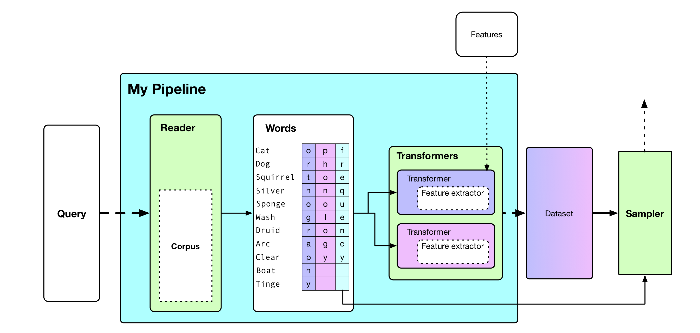

# wordkit



This is the repository of the `wordkit` package, a `Python 3.X` package for the featurization of words into orthographic and phonological vectors.

## Overview

`wordkit` is a package for working with words.
The package contains a variety of functions that allow you to:
* Extract words from lexical databases in a structured format.
* Normalize phonological strings across languages and databases.
* Featurize words for usage in computational psycholinguistic models using the following features:
    * Open Bigrams
    * Wickelgraphs
    * Wickelfeatures
    * Consonant Vowel mapping (patpho)
    * Onset Nucleus Coda mapping
* Find synonyms, homographs, and homophones across languages.
* Fuse lexical databases, also crosslingually.
* Sample from (subsets of) corpora by frequency of occurrence.

and much more.

## Installation

`wordkit` is on pip.

`pip install wordkit`

## Examples

See the [examples](examples) for some ways in which you can use `wordkit`.
All examples assume you have wordkit installed (see above.)

## More

If, after working through the examples, you want to dive deeper into `wordkit`, check out the following documentation.

`wordkit` is a modular system, and contains two broad families of components.
The subpackages are documented using separate `README.MD` files.
Feel free to click ahead to find descriptions of the contents of subpackages.

* [corpora](wordkit/corpora)
* [features](wordkit/features)

In general, a `wordkit` pipeline consists of one or more readers, which extract structured information from corpora.
This information is then sent to one or more transformers, which are either assigned pre-defined features or a feature extractor.

## Paper

A paper that describes `wordkit` was accepted at LREC 2018.
If you use `wordkit` in your research, please cite the following paper:

```
@InProceedings{TULKENS18.249,
  author = {Tulkens, Stéphan and Sandra, Dominiek and Daelemans, Walter},
  title = {WordKit: a Python Package for Orthographic and Phonological Featurization},
  booktitle = {Proceedings of the Eleventh International Conference on Language Resources and Evaluation (LREC 2018)},
  year = {2018},
  month = {may},
  date = {7-12},
  location = {Miyazaki, Japan},
  editor = {Nicoletta Calzolari (Conference chair) and Khalid Choukri and Christopher Cieri and Thierry Declerck and Sara Goggi and Koiti Hasida and Hitoshi Isahara and Bente Maegaard and Joseph Mariani and Hélène Mazo and Asuncion Moreno and Jan Odijk and Stelios Piperidis and Takenobu Tokunaga},
  publisher = {European Language Resources Association (ELRA)},
  address = {Paris, France},
  isbn = {979-10-95546-00-9},
  language = {english}
  }
```


Additionally, if you use any of the corpus readers in `wordkit`, you MUST cite the accompanying corpora and transformers.
All of these references can be found in the docstrings of the applicable classes.

## Example

This example shows one big `wordkit` pipeline.

```python
import pandas as pd

from wordkit.corpora import celex_english, celex_dutch
from wordkit.features import LinearTransformer, WickelTransformer, fourteen
from string import ascii_lowercase

# The fields we want to extract from our corpora.
fields = ('orthography', 'frequency', 'phonology', 'syllables')

# Link to epl.cd
english = celex_english("epw.cd",
                        fields=fields)
# Link to dpl.cd
dutch = celex_dutch("dpw.cd",
                    fields=fields)

# Merge both corpora.
words = pd.concat([english, dutch], sort=False).reindex()

# We filter both corpora to only contain monosyllables and words
# with only alphabetical characters
words = words[[len(x) == 1 for x in words["syllables"]]]
words = words[[not set(x) - set(ascii_lowercase)
              for x in words["orthography"]]]

# words.iloc[0] =>
# orthography                      a
# phonology                   (e, ɪ)
# syllables                ((e, ɪ),)
# frequency                   844672
# log_frequency              5.92669
# frequency_per_million        21363
# zipf_score                 4.32966
# length                           1

# You can also query specific words
wind = words[words['orthography'] == "wind"]

# This gives
# wind =>
#        orthography        phonology  ... zipf_score  length
# 146523        wind  (w, a, ɪ, n, d)  ...   0.015757       4
# 146524        wind     (w, ɪ, n, d)  ...   1.683096       4
# 313527        wind     (w, ɪ, n, t)  ...   2.042675       4

# Now, let's transform into features
# Orthography is a linear transformer with the fourteen segment feature set.
o = LinearTransformer(fourteen, field='orthography')
# For phonology we use Wickelphones.
p = WickelTransformer(n=3, field='phonology')

X_o = o.fit_transform(words)
X_p = p.fit_transform(words)

# Get the feature vector length for each featurizer
o.vec_len # 126
p.vec_len # 5415
```

## Corpora

`wordkit` currently offers readers for the following corpora.
Note that, while we offer predefined fields for all these corpora, any fields present in these data can be retrieved by `wordkit` in addition to the fields we define.
The Lexicon Projects, for example, also contain lexicality information, accuracy information, and so on.
These can be retrieved by passing the appropriate fields as argument to `fields`.

#### BPAL

[Download](http://www.pc.rhul.ac.uk/staff/c.davis/Utilities/B-Pal.zip)

You have to extract the `nwphono.txt` file from the `.exe` file.
The corpus is not for download in a more practical fashion.

[Publication](http://www.pc.rhul.ac.uk/staff/c.davis/Articles/Davis_Perea_in_press.pdf)

```
Fields:     Orthography, Phonology, Frequency
Languages:  Spanish
```

#### Celex

Currently not freely available.  

```
Fields:     Orthography, Phonology, Syllables, Frequency
Languages:  Dutch, German, English
```

**WARNING:** the Celex frequency norms are no longer thought to be correct. Please use the `SUBTLEX` frequencies instead.
You can use the Celex corpus with `SUBTLEX` frequency norms by using a [`merge`](wordkit/corpora#merge).   
If you use `CELEX` frequency norms at a psycholinguistic conference, you _will_ get yelled at.

#### CMUDICT

[Download](https://github.com/cmusphinx/cmudict)

We can read the `cmudict.dict` file from the above repository.

```
Fields:     Orthography, Syllables  
Languages:  American English
```

#### Deri

[Download](https://drive.google.com/open?id=0B7R_gATfZJ2aUWsxbF9CSEo1Y00)

Download the `pron_data.tar.gz` file, and unzip it. We use the `gold_data_train` file.

[Publication](http://isi.edu/~aderi/papers/g2p.pdf)

```
Fields:     Orthography, Phonology  
Languages:  lots
```

**WARNING:** we manually checked the Dutch, Spanish and German phonologies in this corpus, and a lot of them seem to be incorrectly transcribed or extracted. Only use this corpus if you don't have another resource for your language.

#### Lexique

[Download](http://lexique.org/telLexique.php)  

Download the zip file, we use the `lexique382.txt` file.

[Publication](https://link.springer.com/content/pdf/10.3758/BF03195598.pdf)

Note that this is the publication for Lexique version 2. Lexique 3 does not seem to have an associated publication in English.

```
Fields:     Orthography, Phonology, Frequency, Syllables  
Languages:  French
```

**NOTE:** the currently implemented reader is for version 3.82 (the most recent version as of May 2018) of Lexique.

#### SUBTLEX

Check the link below for the various SUBTLEX corpora and their associated publications.
We support all of the formats from the link below.

[Link](http://crr.ugent.be/programs-data/subtitle-frequencies)

```
Fields:     Orthography, Frequency  
Languages:  Dutch, American English, Greek
            British English, Polish, Chinese,
            Spanish
```

#### Wordnet

We support all the tab-separated formats of the open multilingual WordNet.
If you use any of these WordNets, please cite the appropriate source, as well as the official WordNet reference.

[Link](http://compling.hss.ntu.edu.sg/omw/)

```
Fields: Orthography, Semantics
Languages: lots
```

#### Lexicon projects

We support all lexicon projects.
These contain RT data with which you can validate models.

[Link](http://crr.ugent.be/programs-data/lexicon-projects)

```
Fields: Orthography, rt
Languages: Dutch, British English, American English, French
```

## Experiments

The code for replicating the experiments in the `wordkit` paper can be found [here](https://github.com/stephantul/lrec2018)

## Requirements

- ipapy
- numpy
- pandas (for some of the corpus readers)
- reach (for the semantics)
- nltk (for wordnet-related semantics)


## Contributors

Stéphan Tulkens

## License

GPL v3
